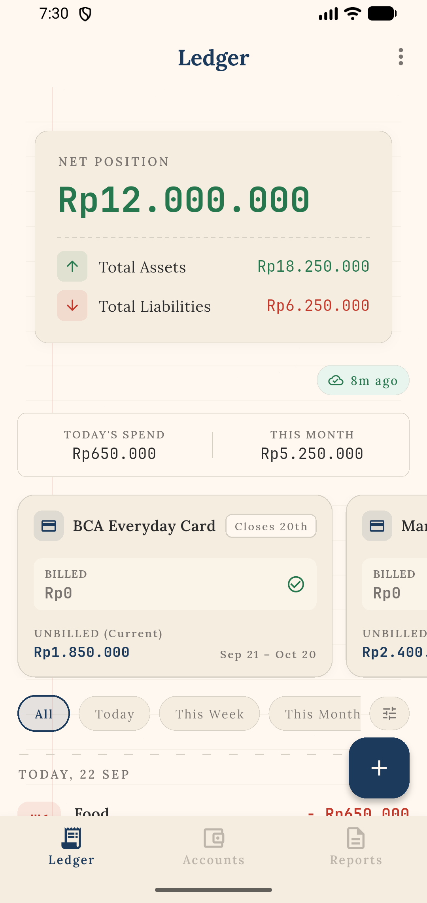
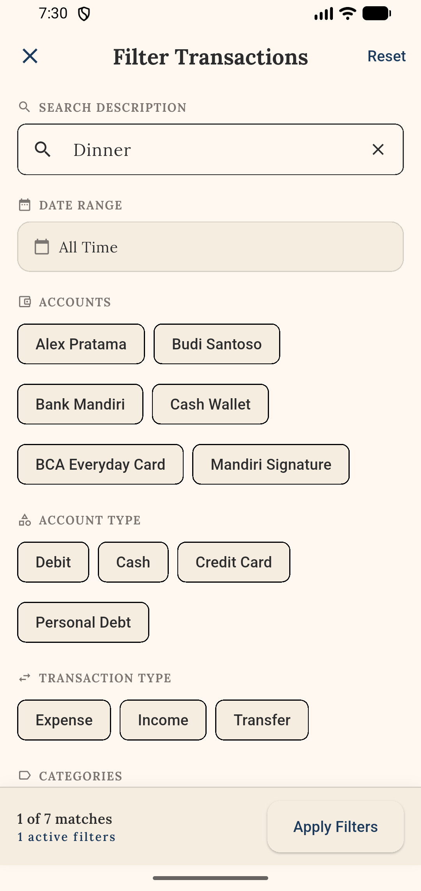
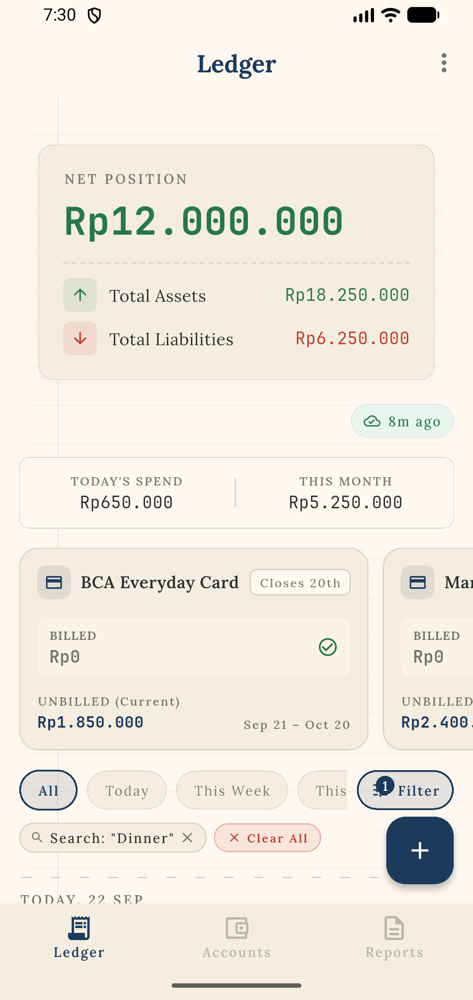
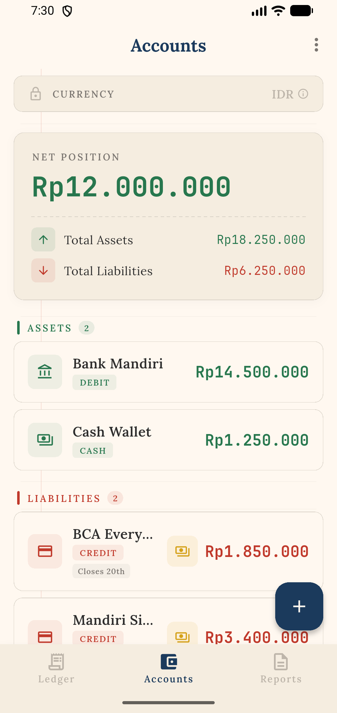
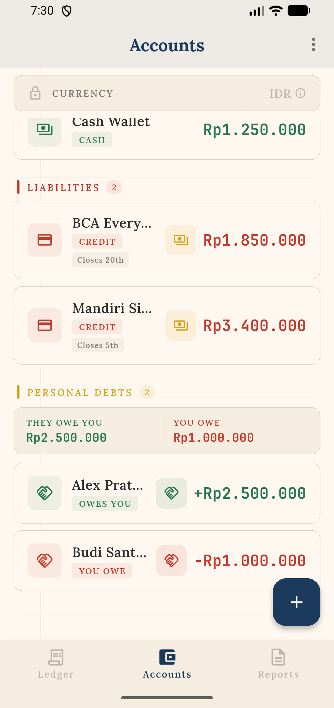
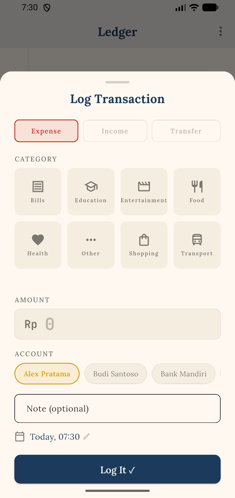
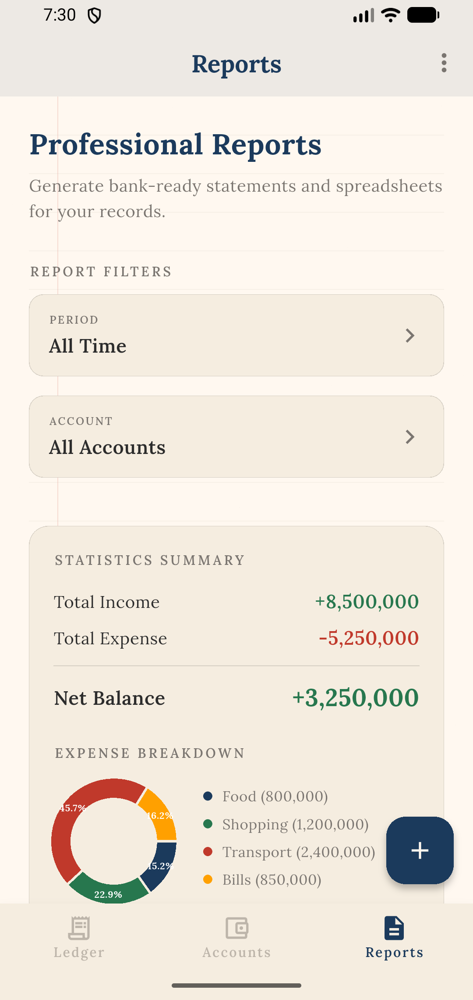
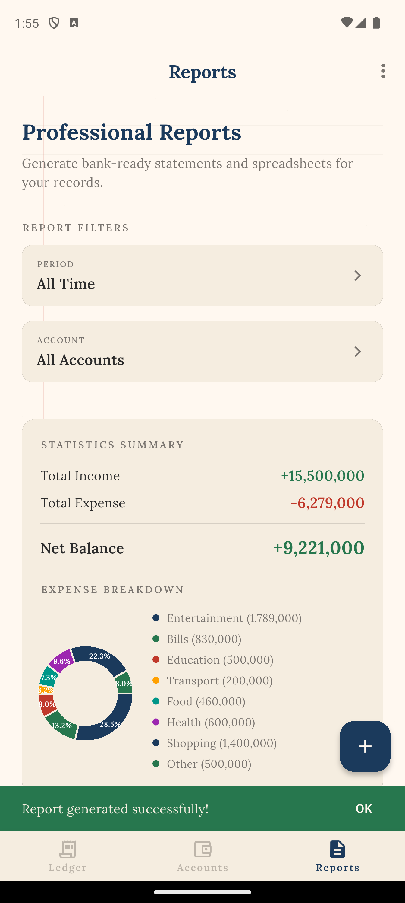

# VentExpensePro 📈

**The Analog Digital Ledger** — A privacy-first, tactile personal finance and debt management application built with Flutter.

VentExpensePro combines the intentionality and elegance of a physical paper ledger with modern automated financial calculations: multi-dimensional search filtering, credit card billing cycle modeling, personal debt tracking (*piutang* / *hutang*), bank-ready multi-page PDF generation, and sandboxed Google Drive cloud synchronization.

---

## 📱 Visual Showcase (v2.0.0)

| Smart Ledger Feed | 7-Dimensional Filters | Filtered Ledger View |
|:---:|:---:|:---:|
|  |  |  |
| *Continuous receipt journal, billing carousel, and net position* | *7 orthogonal dimensions with real-time match counting* | *Active filter chips with surgical one-tap removal* |

| Accounts & Net Position | Personal Debts (*Piutang & Hutang*) | Settle Debt Workflow |
|:---:|:---:|:---:|
|  |  |  |
| *Assets vs. liabilities breakdown with real-time solvency* | *Person-as-account debt tracking with debt summary strip* | *Auto-direction detection and atomic balance adjustment* |

| Quick Add Transaction | In-App Analytics | Bank-Ready PDF Export |
|:---:|:---:|:---:|
|  |  |  |
| *Expense, income, and transfer logging with validation* | *Dynamic date/account filters, charts, and debt summaries* | *Archival multi-page statements with dedicated appendices* |

---

## ✨ Core Features

### 📒 Smart Ledger & Tactile Feed
* **Analog Receipt Aesthetics**: Styled after physical cash register tapes with jagged edges, perforation lines, and warm archival paper canvases (`#FFF8F0`).
* **Consolidated Net Position**: Real-time solvency indicator ($\text{Total Assets} - \text{Total Liabilities}$) updating reactively on every transaction.
* **Quick Stats Strip**: At-a-glance daily and monthly spending metrics.
* **Billing Cycle Carousel**: Horizontal overview cards tracking credit card cutoffs and current unbilled charges.

### 🔍 7-Dimensional Filter Engine
* **Orthogonal Search Dimensions**: Search across free text notes, transaction types (`expense`, `income`, `transfer`), specific accounts, account categories (bank, cash, credit, debt), expense categories, min/max amounts, and custom date ranges.
* **Live Match Previews (`countMatching`)**: Instant feedback inside the filter modal indicating exactly how many transactions match current selections before applying.
* **Surgical Chip Dismissal**: Active filters render as dismissal chips on the ledger feed for quick removal without wiping entire filter sets.

### 🏦 Accounts & Personal Debt Engine
* **Asset vs. Liability Segregation**: Clean separation between liquidity assets (debit, cash) and obligations (credit cards, payables).
* **Person-as-Account Architecture**: Tracks loans and borrowings on an individual basis.
  * **Receivable (*Piutang*)**: Positive balance — money owed to you, counting toward total assets.
  * **Payable (*Hutang*)**: Negative balance — money you owe others, counting toward total liabilities.
* **Automated Settlement (`SettleDebt`)**: Automatically detects cash flow direction, adjusts both balances atomically, logs audit records, and marks settled debts with an authentic **"PAID IN FULL"** stamp.

### 💳 Credit Card Billing Cycles & Pay Bill
* **Statement Close Day (1–28)**: Configures statement closing cutoffs with month-end date clamping.
* **Unbilled vs. Billed Segregation**: Automatically isolates charges from previous closed cycles (due for payment) from active ongoing spending.
* **Transfer Invariant Enforcement**: Generic transfers cannot originate from or deposit directly into credit accounts.
* **One-Touch Pay Bill (`SettleCreditBill`)**: Dedicated payment flow deducting from bank/cash and reducing credit card liabilities.

### 📊 In-App Analytics & Multi-Page PDF Statements
* **Dynamic Visual Charts**: Category donut charts (`fl_chart`), income vs. expense breakdowns, and reactive token-hash auto-refreshes.
* **Archival Multi-Page Statements (`PdfReportService`)**:
  * Rendered in vintage typography (*Lora* serif and *JetBrains Mono*).
  * **Main Statement**: Executive summary, category charts, and itemized transaction tables.
  * **Dedicated Appendix 1**: Comprehensive Debt & Lending summary with receivables, payables, and settlement history.
  * **Dedicated Appendix 2**: Credit card billing summary with cutoff dates, billed/unbilled amounts, and total credit liabilities.
* **Native Document Sharing**: Instant export and sharing via `share_plus`.

### ☁️ Privacy-First Cloud Sync
* **Google Drive AppData Scope**: Backups are written directly to your private, hidden Google Drive app directory (`drive.appdata`). Invisible in general Drive folders and inaccessible by third parties.
* **Local-First & Zero Server**: No central databases or tracking servers. Full functionality completely offline.

---

## 🛠️ Tech Stack & Engineering Standards

* **Framework**: [Flutter](https://flutter.dev/) (3.11+) & Pure Dart
* **Architecture**: Clean Architecture (Presentation, Domain, Data, Core)
* **State Management**: [Provider](https://pub.dev/packages/provider)
* **Local Persistence**: [Sqflite](https://pub.dev/packages/sqflite) (SQLite v2 with sequential schema migrations)
* **Dependency Injection**: [GetIt](https://pub.dev/packages/get_it) (`sl`)
* **Visualization & Documents**:
  * [fl_chart](https://pub.dev/packages/fl_chart) for dynamic vector charts
  * [pdf](https://pub.dev/packages/pdf) & [path_provider](https://pub.dev/packages/path_provider) for document compilation
  * [share_plus](https://pub.dev/packages/share_plus) for native sharing intents
* **Cloud Infrastructure**: Google Drive REST API via [google_sign_in](https://pub.dev/packages/google_sign_in) and [googleapis](https://pub.dev/packages/googleapis)
* **Quality & Test Coverage**:
  * **219 Unit and Widget Tests** (100% pass rate)
  * End-to-end integration test suite and automated Play Store screenshot generation (`integration_test/`)

---

## 🚀 Getting Started

### Prerequisites
* Flutter SDK (3.11.0 or higher)
* Android Studio / VS Code with Dart & Flutter extensions
* Android SDK 33+ or iOS 15+ device / emulator

### Local Installation
```bash
# 1. Clone repository
git clone https://github.com/HellBus1/VentExpensePro.git
cd VentExpensePro

# 2. Install dependencies
flutter pub get

# 3. Run all unit and widget tests
flutter test

# 4. Launch on connected device or emulator
flutter run
```

### Production Build (Android)
Production releases are protected with R8 code shrinking and ProGuard obfuscation:

```bash
flutter build apk --release
```

---

## 📖 Technical Documentation

Comprehensive architectural blueprints and user guides are available in the **[`/docs`](docs/README.md)** directory:

* **[Architecture Overview](docs/ARCHITECTURE_OVERVIEW.md)**: System design, Clean Architecture layers, SQLite schema, ERD, and data flow sequences.
* **[Smart Ledger & 7-D Filters](docs/FEATURE_SMART_LEDGER_AND_FILTERS.md)**: In-depth breakdown of transaction flows and multi-criteria filter mechanics.
* **[Accounts & Personal Debts](docs/FEATURE_ACCOUNTS_AND_PERSONAL_DEBTS.md)**: Debt accounting, balance conventions, and settlement invariants.
* **[Credit Cards & Billing Cycles](docs/FEATURE_CREDIT_CARDS_AND_BILLING_CYCLES.md)**: Statement cutoffs, unbilled vs. billed aggregation, and Pay Bill flow.
* **[Reports & PDF Generation](docs/FEATURE_REPORTS_AND_PDF_GENERATION.md)**: In-app analytics architecture and archival PDF generation engine.
* **[Manual QA Test Checklist](docs/MANUAL_QA_TEST_CHECKLIST.md)**: 9 test suites containing structured test cases for manual verification.
* **[Google Drive Sync Architecture](docs/GOOGLE_DRIVE_SYNC_ARCHITECTURE.md)** & **[OAuth Setup Guide](docs/GOOGLE_OAUTH_SETUP_GUIDE.md)**: Cloud sync protocols and credentials configuration.

---

## 📄 License
This project is open-source under the terms of the `LICENSE` file.
