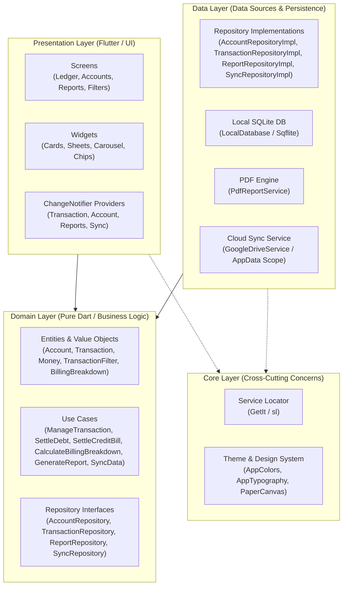
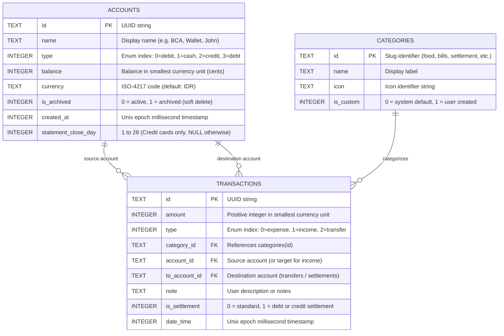
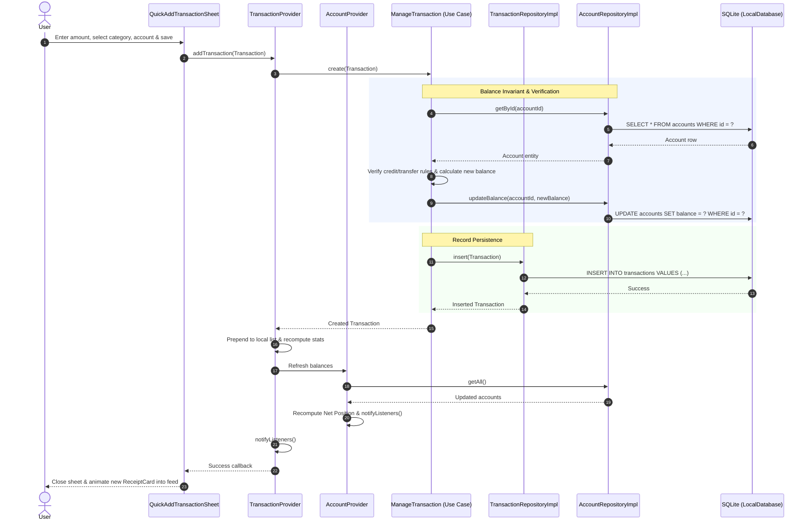

# Architecture Overview & System Design

**VentExpensePro** is an analog-digital personal finance management application built with Flutter. It combines the privacy, tactile clarity, and intentionality of a physical paper ledger with modern automated financial calculations, multi-dimensional search filtering, credit card billing cycle modeling, personal debt tracking, bank-ready PDF export, and sandboxed Google Drive cloud synchronization.

---

## 1. Architectural Pattern: Clean Architecture

The application strictly enforces **Clean Architecture** principles to achieve separation of concerns, testability, and independence from external frameworks and persistence mechanisms.



### Dependency Inversion & Invariant Boundaries
1. **Domain Layer (Center of System)**: Contains zero dependencies on Flutter UI (`package:flutter` is only referenced where standard value types like `DateTimeRange` or `ChangeNotifier` are essential for integration). All entities, use cases, and repository interfaces reside here.
2. **Data Layer**: Implements domain repository interfaces. Handles SQLite database interactions via `sqflite`, PDF document generation via `pdf`, and Google Drive API serialization.
3. **Presentation Layer**: Built with Flutter widgets, custom canvas painters (`PaperBackground`), and `Provider` state management. UI widgets observe providers and dispatch user actions directly through domain use cases.
4. **Core Layer**: Manages the dependency injection registry (`sl`), shared constants, themes, and utility mappers.

---

## 2. Directory Layout & Module Structure

```text
lib/
├── core/
│   ├── di/
│   │   └── service_locator.dart       # GetIt registry configuring singletons & factories
│   ├── theme/
│   │   ├── app_colors.dart            # Paper, ink, stamp, and ledger color palette
│   │   └── app_typography.dart        # Lora (serif) & JetBrains Mono (monospace) type styles
│   └── utils/
│       └── category_icon_mapper.dart  # Icon resolver for standard and custom categories
├── data/
│   ├── datasources/
│   │   ├── google_drive_service.dart  # OAuth2 authentication & AppData Drive file storage
│   │   ├── local_database.dart        # SQLite schema definition, migrations, and seeding
│   │   └── pdf_report_service.dart    # Multi-page PDF generation engine with ink-and-paper theme
│   ├── models/
│   │   ├── account_model.dart         # SQLite map serialization for accounts
│   │   ├── category_model.dart        # SQLite map serialization for categories
│   │   └── transaction_model.dart     # SQLite map serialization for transactions
│   └── repositories/
│       ├── account_repository_impl.dart
│       ├── category_repository_impl.dart
│       ├── report_repository_impl.dart
│       ├── sync_repository_impl.dart
│       └── transaction_repository_impl.dart
├── domain/
│   ├── entities/
│   │   ├── account.dart               # Account entity (Asset, Liability, Personal Debt)
│   │   ├── category.dart              # Category entity
│   │   ├── enums.dart                 # AccountType (debit, cash, credit, debt) & TransactionType
│   │   ├── sync_exception.dart        # Custom sync failure domain exceptions
│   │   ├── sync_status.dart           # Cloud sync state model
│   │   └── transaction.dart           # Financial transaction entity
│   ├── repositories/                  # Pure repository contracts
│   │   ├── account_repository.dart
│   │   ├── category_repository.dart
│   │   ├── report_repository.dart
│   │   ├── sync_repository.dart
│   │   └── transaction_repository.dart
│   ├── usecases/                      # Encapsulated business operations
│   │   ├── calculate_billing_breakdown.dart
│   │   ├── calculate_net_position.dart
│   │   ├── generate_report.dart
│   │   ├── log_transaction.dart
│   │   ├── manage_account.dart
│   │   ├── manage_transaction.dart
│   │   ├── settle_credit_bill.dart
│   │   ├── settle_debt.dart
│   │   └── sync_data.dart
│   └── value_objects/
│       ├── billing_breakdown.dart     # Unbilled vs billed calculation model
│       ├── money.dart                 # Fixed-point currency formatting (cents/sen)
│       └── transaction_filter.dart    # Immutable 7-dimensional search criteria
└── presentation/
    ├── painters/
    │   └── paper_background.dart      # Custom painter rendering textured paper background
    ├── providers/
    │   ├── account_provider.dart      # Account state, balances, and Net Position breakdown
    │   ├── category_provider.dart     # Category management state
    │   ├── currency_provider.dart     # Active currency symbol & code state
    │   ├── reports_provider.dart      # Analytics caching, debt summary & PDF generation state
    │   ├── sync_provider.dart         # Google Drive authentication & backup lifecycle state
    │   └── transaction_provider.dart  # Transaction feed, 7-D filtering, and stats state
    ├── screens/
    │   ├── accounts_screen.dart       # Account cards, liabilities, and personal debts feed
    │   ├── ledger_screen.dart         # Main receipt feed, filter bar, and billing carousel
    │   ├── reports_screen.dart        # In-app charts, debt/credit reports, and PDF exporter
    │   └── transaction_filter_screen.dart # Full-screen 7-D filter configuration modal
    └── widgets/                       # Modular UI components (ReceiptCard, SettleDebtSheet, etc.)
```

---

## 3. Database Schema & Migration Model

VentExpensePro uses **SQLite** via `sqflite` for local persistence. Monetary values are stored as integers representing the smallest unit of currency (cents / sen) to avoid floating-point rounding errors.

### Entity Relationship Diagram (ERD)



### Schema Migrations (`local_database.dart`)
- **Version 1**: Initial release schema (`accounts`, `transactions`, `categories`).
- **Version 2**: Added `statement_close_day INTEGER` to `accounts` to support credit card billing cycle cutoffs (closes on day 1–28).
- **Sequential Migration Strategy**: Each version bump uses an isolated `if (oldVersion < N)` block to allow sequential upgrades from any previous version.

```dart
static Future<void> _onUpgrade(Database db, int oldVersion, int newVersion) async {
  if (oldVersion < 2) {
    await db.execute('ALTER TABLE accounts ADD COLUMN statement_close_day INTEGER');
  }
}
```

---

## 4. End-to-End Data Flow

The following sequence diagram demonstrates the flow of data from a user action in the presentation layer down through use cases, repositories, and persistence, followed by reactive UI state notification.



---

## 5. Security & Privacy Sandbox Model

1. **Local-First Zero-Knowledge**: No custom backend servers, analytics trackers, or third-party ad networks exist in VentExpensePro. All transactional data remains exclusively on the client device.
2. **Google Drive AppData Sandbox**: Cloud backup and synchronization uses the `https://www.googleapis.com/auth/drive.appdata` OAuth scope. Files stored in this folder are invisible in the user's regular Google Drive file list and cannot be accessed by other applications.
3. **Production Obfuscation (R8/ProGuard)**: Release builds for Android strip all debug metadata and obfuscate class and method symbols to protect local schema logic and cryptographic implementations.
