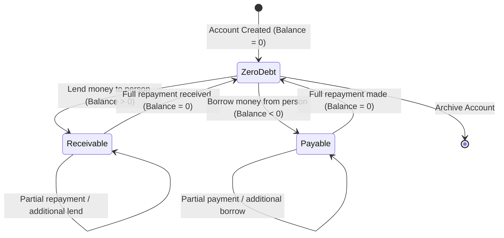
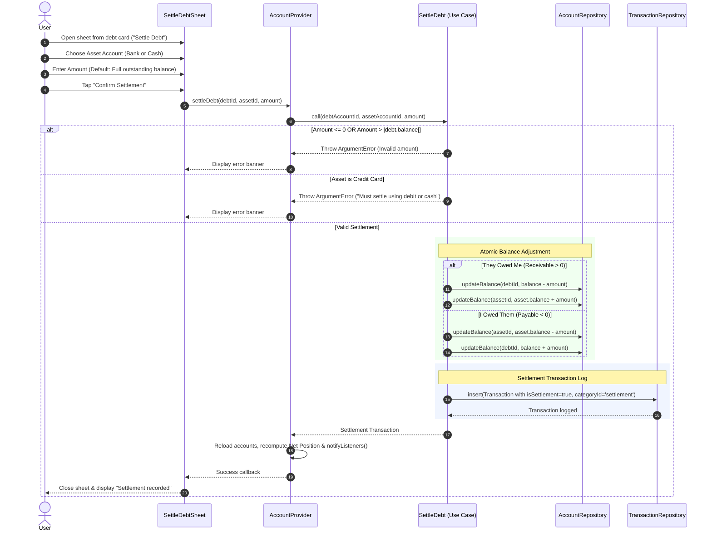

# Feature Guide: Accounts & Personal Debt Engine

VentExpensePro manages multi-account personal balance sheets by organizing accounts into **Assets**, **Liabilities**, and **Personal Debts**. It features a specialized personal debt engine that tracks receivables (*piutang*) and payables (*hutang*) on a per-person basis with automated settlement accounting.

---

## 1. Account Classification & Net Position

Accounts represent distinct financial buckets. Each account belongs to one of four types (`AccountType`):

| Account Type | Classification | Sign Convention | Real-World Example |
|---|---|---|---|
| **Debit (`0`)** | **Asset** | Positive ($>0$) = Available balance | BCA checking, Mandiri savings |
| **Cash (`1`)** | **Asset** | Positive ($>0$) = Physical notes/coins | Physical wallet, home emergency cash |
| **Credit (`2`)** | **Liability** | Positive ($>0$) = Outstanding balance owed | BCA Everyday Card, Mandiri Visa |
| **Debt (`3`)** | **Dynamic** | **Positive ($>0$) = Receivable (Asset)** **Negative ($<0$) = Payable (Liability)** | Friend ("Budi"), Colleague ("Sarah") |

### Net Position Calculation (`CalculateNetPosition`)

The app computes a consolidated financial health metric displayed on the `NetPositionCard`:

$$\text{Total Assets} = \sum \text{Debit} + \sum \text{Cash} + \sum_{\text{Debt} > 0} \text{Debt Balance}$$

$$\text{Total Liabilities} = \sum \text{Credit} + \sum_{\text{Debt} < 0} |\text{Debt Balance}|$$

$$\text{Net Position} = \text{Total Assets} - \text{Total Liabilities}$$

- **Surplus ($\ge 0$)**: Rendered in Ink Green (`#27774E`).
- **Deficit ($< 0$)**: Rendered in Stamp Red (`#C0392B`).

---

## 2. Personal Debt Tracking Architecture

Instead of treating debts as generic uncategorized expenses, VentExpensePro models each individual debtor or creditor as an **Account** with `AccountType.debt`.

### Debt Sign Convention

- **Receivable (*Piutang*)**: You lent money to a person. They owe you. The balance is **positive** ($+Rp\ 500.000$). This counts toward your total assets.
- **Payable (*Hutang*)**: You borrowed money from a person. You owe them. The balance is **negative** ($-Rp\ 300.000$). This counts toward your total liabilities.
- **Zero Debt**: Balance is exactly $0$. The `ZeroDebtStamp` widget displays an analog red stamp stating **"SETTLED"** across the account card.

---

## 3. The Debt Settlement Workflow (`SettleDebt`)

Settling a debt updates both the person's debt account and the user's real cash or bank account in a single atomic transaction.

### Auto-Direction Detection
The use case inspects `debtAccount.balance` to automatically determine cash flow:
1. **If Balance $> 0$ (Receivable - They Pay You)**:
   - **Source Account**: Debt Account (debt balance decreases toward 0).
   - **Destination Account**: Selected Debit or Cash account (asset balance increases).
2. **If Balance $< 0$ (Payable - You Pay Them)**:
   - **Source Account**: Selected Debit or Cash account (asset balance decreases).
   - **Destination Account**: Debt Account (debt balance increases toward 0).

### Invariant & Validation Rules
- **Non-Zero Requirement**: Throws `ArgumentError` if the debt is already fully settled ($0$).
- **Positive Amount**: Settlement amount must be strictly $> 0$.
- **Cap Invariant**: Settlement amount cannot exceed the absolute outstanding debt ($|balance|$).
- **Valid Settlement Instrument**: Settlement **must** use a Debit or Cash account. Credit cards are strictly forbidden as settlement sources.
- **Sufficient Funds**: When paying off a payable debt, the selected asset account must hold sufficient funds.

---

## 4. Accounts Screen User Interface

The `AccountsScreen` renders accounts in three clearly separated visual tiers:
1. **Assets Header & Cards**: Bank accounts and cash wallets showing available liquidity in ink green.
2. **Liabilities Header & Cards**: Credit cards showing current drawn credit with a direct **"Pay Bill"** action button.
3. **Personal Debts Header, Summary Strip & Cards**:
   - **Debt Summary Strip**: Two-column metric card showing total **"THEY OWE YOU"** (Receivables) vs **"YOU OWE"** (Payables).
   - **Person Cards**: Individual cards showing the person's name, net debt amount, and contextual **"Settle Debt"** button when balance $\ne 0$.
   - **Archive Protection**: Long-pressing an account prompts for soft-archiving, preserving transaction history without cluttering active accounts.
