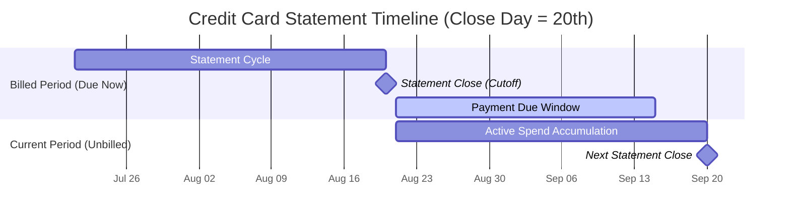
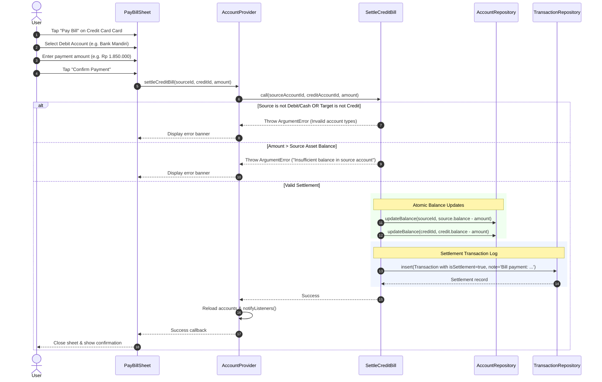

# Feature Guide: Credit Cards & Billing Cycle Engine

VentExpensePro models credit cards as revolving liability accounts, pairing realistic statement close cutoffs with automated segregation of **unbilled pending charges** versus **billed statement balances**.

---

## 1. Credit Card Liability Model

In VentExpensePro:
- An account with `AccountType.credit` represents a credit card or line of credit.
- **Balance Sign**: Unlike assets where positive means money in hand, a positive balance on a credit card ($+Rp\ 1.850.000$) denotes an **outstanding debt owed to the card issuer**.
- **Net Position Impact**: Every charge increases liabilities, directly reducing Net Position.

### Transaction Invariant Restrictions
To prevent artificial manipulation of credit liabilities and maintain strict double-entry ledger integrity:
1. **No Outbound Generic Transfers**: A credit card **cannot** be the source of a generic transfer (`TransactionType.transfer`). You cannot transfer "credit" to another account as free money.
2. **No Inbound Generic Transfers**: Generic transfers **cannot** target a credit card directly.
3. **Dedicated Settlement Channel**: All repayments must flow exclusively through the **Pay Bill settlement workflow** (`SettleCreditBill`), which tags transactions with `isSettlement: true`.

---

## 2. Statement Close Day & Billing Periods

Credit cards configure a **Statement Close Day** (`statementCloseDay`, an integer between 1 and 28).



### Period Computation Logic (`account.dart`)
Given a card with `statementCloseDay = 20`:

#### Case A: Current Date is on or before the Close Day (e.g., September 15)
- **Current Billing Period (Unbilled)**: Aug 21 $\to$ Sep 20 (23:59:59)
- **Previous Billing Period (Billed, Due Now)**: Jul 21 $\to$ Aug 20 (23:59:59)

#### Case B: Current Date is after the Close Day (e.g., September 25)
- **Current Billing Period (Unbilled)**: Sep 21 $\to$ Oct 20 (23:59:59)
- **Previous Billing Period (Billed, Due Now)**: Aug 21 $\to$ Sep 20 (23:59:59)

Month-end dates are automatically clamped via `_clampDay` to prevent invalid dates during 28-, 30-, and 31-day months.

---

## 3. Billed vs Unbilled Aggregation (`CalculateBillingBreakdown`)

The `CalculateBillingBreakdown` use case iterates through expense transactions assigned to the credit card:

```mermaid
graph LR
    TxnStream[All Credit Card Expenses] --> Split{Transaction Date?}
    Split -- Inside Previous Period -- Billed[Billed Amount\nPayment Due Now]
    Split -- Inside Current Period -- Unbilled[Unbilled Amount\nPending Next Statement]
    Split -- Outside Both Ranges -- Archived[Historical / Prior]

    Billed --> UI[BillingSummaryWidget & Reports]
    Unbilled --> UI
```

### `BillingBreakdown` Value Object
```dart
class BillingBreakdown {
  final int billedAmount;       // Charges from previous cycle (statement closed)
  final int unbilledAmount;     // Charges from active ongoing cycle
  final DateTimeRange? billedPeriod;
  final DateTimeRange? unbilledPeriod;
  final DateTime? dueDate;
  
  int get totalOutstanding => billedAmount + unbilledAmount;
}
```

---

## 4. One-Touch Pay Bill Settlement (`SettleCreditBill`)

When the user taps **"Pay Bill"** on an `AccountCard` or the `BillingSummaryWidget`, the `PayBillSheet` guides the payment.

### Settlement Execution Steps
1. **Asset Selection**: The user selects a source asset account (Debit Bank or Cash Wallet).
2. **Amount Configuration**: Defaults to the statement billed amount or full balance, editable by the user.
3. **Execution**:
   - Deducts funds from the source asset account (`asset.balance - amount`).
   - Reduces credit liability balance (`credit.balance - amount`).
   - Creates a transaction record with `type: TransactionType.transfer`, `categoryId: 'settlement'`, and `isSettlement: true`.



---

## 5. UI Integration

### Ledger Screen Carousel (`BillingSummaryWidget`)
- Located directly below the Quick Stats strip on the Ledger screen.
- Renders horizontal swipeable cards for every credit card configured with a billing cycle.
- **Card Elements**:
  - Bank/Card name and statement cutoff pill (`Closes 20th`).
  - **Billed Amount**: Highlighted in stamp red with warning icon if unpaid; shows green checkmark `Rp 0` and *"All caught up!"* when fully paid.
  - **Unbilled Amount**: Subdued text showing ongoing spend in current cycle.
  - **Two-Tone Progress Bar**: Visual proportional bar illustrating billed (red) vs unbilled (amber/light) ratio.
  - Direct tap opens the `PayBillSheet`.

### Reports Screen Breakdown
- Detailed card displaying aggregate credit card debt across all active credit accounts.
- Itemized card list showing individual card unbilled and billed dates, ratio indicators, and total credit liability.
