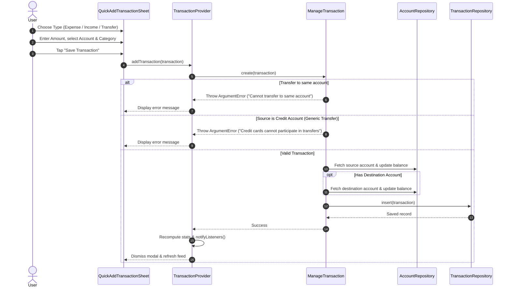

# Feature Guide: Smart Ledger & 7-Dimensional Filters

The **Smart Ledger** is the central workspace of VentExpensePro. It delivers a tactile, paper-style transaction feed inspired by analog cash register tapes, backed by high-performance multi-criteria search and real-time balance calculations.

---

## 1. Visual & Interaction Design

The Ledger screen renders a continuous receipt journal with distinct visual elements:
- **`PaperBackground`**: A textured warm paper canvas (`#FFF8F0`) that anchors the analog aesthetic.
- **`NetPositionCard`**: Real-time snapshot of overall financial solvency ($\text{Total Assets} - \text{Total Liabilities}$).
- **`SyncStatusChip`**: Live indicator of Google Drive cloud synchronization status.
- **`QuickStatsStrip`**: Compact metrics displaying **Today's Spending** and **This Month's Spending**.
- **Credit Card Billing Carousel**: Horizontal preview cards highlighting statement close cutoffs and current unbilled charges.
- **Filter Bar & Active Filter Chips**: Interactive filter modal trigger with dynamic badge count and dismissible active filter tags.
- **`ReceiptDateHeader` & `ReceiptCard`**: Transactions grouped chronologically with receipt-inspired perforations, monospace financial numbers, and clear categorization badges.

---

## 2. Quick Add Transaction Workflow

Users log financial events via `QuickAddTransactionSheet` by tapping the floating action button (`+`) or shortcut triggers.

### Transaction Invariant Rules
| Transaction Type | Balance Effect on Source Account | Destination Account Required? | Special Constraints |
|---|---|---|---|
| **Expense** | Decreases balance (or increases credit liability) | No | Source account balance updated immediately |
| **Income** | Increases balance (or reduces credit liability) | No | Source account is credited |
| **Transfer** | Deducts from source account, adds to target account | Yes | **Credit accounts cannot participate in standard transfers.** (Must use dedicated Pay Bill settlement flow) |

### Logging Flow & Balance Synchronization
When a transaction is created, updated, or deleted, `ManageTransaction` coordinates the atomic updates across both account balances and the transaction ledger.



---

## 3. The 7-Dimensional Filter Engine

VentExpensePro introduces an immutable, multi-dimensional filter value object: **`TransactionFilter`**. It enables granular queries across seven orthogonal criteria:

```mermaid
graph TD
    Input[Incoming Transaction Stream] --> D1{1. Text Search?}
    D1 -- Match substring in note or category -- D2{2. Transaction Type?}
    D1 -- No match -- Discard[Filtered Out]

    D2 -- In selected types? -- D3{3. Account IDs?}
    D2 -- No -- Discard

    D3 -- Matches source or destination? -- D4{4. Account Types?}
    D3 -- No -- Discard

    D4 -- Matches account category? -- D5{5. Category IDs?}
    D4 -- No -- Discard

    D5 -- Matches chosen categories? -- D6{6. Amount Range?}
    D5 -- No -- Discard

    D6 -- minAmount <= amount <= maxAmount? -- D7{7. Date Range?}
    D6 -- No -- Discard

    D7 -- start <= txn.dateTime <= end? -- Accept[Include in Filtered Feed]
    D7 -- No -- Discard
```

### Filter Dimensions Specification

| # | Dimension | Data Type | Matching Logic | Default |
|---|---|---|---|---|
| **1** | **Text Search** | `String?` | Case-insensitive substring match against `transaction.note` | `null` (Matches all) |
| **2** | **Transaction Types** | `List<TransactionType>?` | Included if `types.contains(txn.type)` | `null` (All types) |
| **3** | **Specific Accounts** | `List<String>?` | Matches if `accountIds.contains(txn.accountId)` or `accountIds.contains(txn.toAccountId)` | `null` (All accounts) |
| **4** | **Account Types** | `List<AccountType>?` | Matches if source or destination account matches debit, cash, credit, or debt | `null` (All types) |
| **5** | **Categories** | `List<String>?` | Matches if `categoryIds.contains(txn.categoryId)` | `null` (All categories) |
| **6** | **Amount Range** | `int? minAmount, int? maxAmount` | In cents. Matches if `txn.amount >= min` AND `txn.amount <= max` | `null` (Unconstrained) |
| **7** | **Date Range** | `DateTimeRange?` | Matches if `txn.dateTime >= start` AND `txn.dateTime <= end` (inclusive) | `null` (All time) |

### Boolean Composition Rules
- **Cross-Dimension**: Combined with **AND** logic (a transaction must satisfy every active dimension).
- **Intra-Dimension**: Collections within a dimension combine with **OR** logic (e.g., selecting Food and Transport matches transactions that belong to Food *or* Transport).

---

## 4. Real-Time Count Matching & UI Integration

### Live Match Previews (`countMatching`)
When the user configures criteria inside `TransactionFilterScreen`, the filter modal does not wait for submission to calculate results. It evaluates `TransactionProvider.countMatching(_filter)` in real time on every keystroke and toggle, updating the bottom action button label:
- `"Show 14 Transactions"` (when results exist)
- `"No Matching Transactions"` (disabled when count is zero)

### Active Filter Chips & Badges
- **Ledger Filter Button**: Displays a numbered pill badge indicating the number of active filter dimensions (`filter.activeFilterCount`).
- **Dismissible Chips**: An active filter renders individual tag chips above the transaction list (e.g. `Search: "coffee" [x]`, `Type: Expense [x]`, `Category: Food [x]`). Tapping `[x]` invokes `filter.copyWith(clearCategoryIds: true)` to surgically remove that specific criterion without clearing other filters.
- **Preset Quick Chips**: Instant toggles on the Ledger header for common time ranges:
  - **All Time** (`clearDateRange: true`)
  - **Today** (`DateTime.now()` day window)
  - **This Week** (Monday through Sunday)
  - **This Month** (1st to last day of current calendar month)
