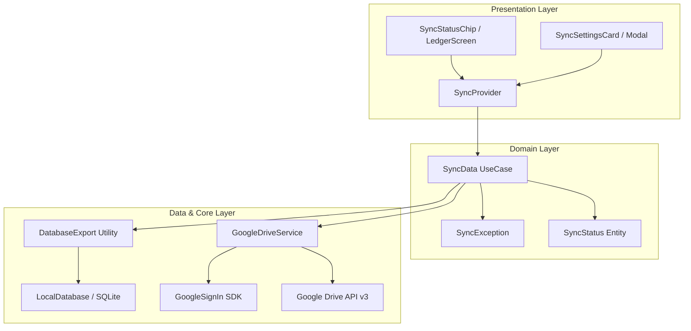

# Google Drive Sync Architecture & Implementation

**VentExpensePro** implements a privacy-first, client-only cloud backup and restore mechanism using **Google Drive's Application Data folder (`appDataFolder`)**.

---

## 1. Design Principles

- **Privacy-First:** User financial data is encrypted in transit and stored exclusively in the user's personal Google Drive account. There is no intermediary backend server or third-party storage.
- **Hidden Sandbox Isolation:** Backups are stored in `appDataFolder`, a hidden partition in Google Drive. This prevents accidental deletion or manual tampering by the user in Google Drive web/mobile UI while keeping their root storage clean.
- **Fail-Safe Restoration:** Imports are wrapped in an atomic SQLite transaction. If any record fails to restore, the transaction rolls back completely to preserve existing data.
- **Pruning & Quota Protection:** A FIFO (First-In, First-Out) retention policy keeps only the **5 most recent backups**, automatically purging older files to minimize Drive storage usage.

---

## 2. Architecture & Layer Decomposition

The feature follows clean architecture principles, separating low-level Drive API operations from business logic and presentation state:



### 2.1 Component Responsibilities

| Component | Path | Responsibility |
|---|---|---|
| **`GoogleDriveService`** | `lib/data/datasources/google_drive_service.dart` | Wraps Google Sign-In and Google Drive API v3 client. Handles raw upload, list, download, and file deletion targeting `appDataFolder`. |
| **`DatabaseExport`** | `lib/core/utils/database_export.dart` | Exports SQLite database tables (`accounts`, `categories`, `transactions`) to JSON, and imports JSON backups inside an atomic transaction. Supports v1 and v2 schema formats. |
| **`SyncData`** | `lib/domain/usecases/sync_data.dart` | Coordinates the backup and restore workflows between `DatabaseExport` and `GoogleDriveService`. |
| **`SyncProvider`** | `lib/presentation/providers/sync_provider.dart` | Manages reactive sync state (`SyncStatus`), handles silent auto-reconnection, caches last backup timestamps in `SharedPreferences`, and formats relative times (*"Just now"*, *"2h ago"*). |
| **`SyncException`** | `lib/domain/entities/sync_exception.dart` | Strongly-typed domain errors: `notSignedIn`, `fileNotFound`, `tokenExpired`, `networkError`, `corruptedBackup`, `unknown`. |

---

## 3. The `appDataFolder` Mechanism

VentExpensePro requests a single restricted scope:
```dart
GoogleSignIn(
  scopes: [drive.DriveApi.driveAppdataScope], // https://www.googleapis.com/auth/drive.appdata
);
```

### Why `appDataFolder` instead of standard `drive.file`?
1. **Zero Clutter:** Backup files do not appear in the user's regular Google Drive file list, search results, or recent files.
2. **Access Security:** The app cannot view or modify any files outside its own hidden folder. It is physically impossible for the app to access personal photos, Google Docs, or spreadsheets.
3. **User Control:** The user can view and clear the storage consumed by the app at any time via **Google Drive Web → Settings → Manage Apps → VentExpensePro**.

---

## 4. File Lifecycle & Retention Policy

Every backup file is serialized as formatted JSON and uploaded with an ISO-8601 timestamp:

```text
vent_expense_backup_2026-09-13T01:05:00.000Z.json
```

### Backup Flow:
1. **Export:** `DatabaseExport.exportAll()` queries local SQLite tables and compiles the dataset into a versioned JSON payload.
2. **Upload:** `GoogleDriveService.uploadBackup()` streams the JSON content into `appDataFolder`.
3. **Prune:** `GoogleDriveService._pruneOldBackups()` lists all files matching prefix `vent_expense_backup_`, sorts them chronologically descending, and deletes all files after the 5th newest.
4. **Cache:** `SyncProvider` saves the latest backup epoch milliseconds to local `SharedPreferences` (`sync_last_backup_epoch_ms`) for instant offline status display.

---

## 5. Schema Migration & Versioning (v1 → v2)

Backups include a root `version` field to support backward-compatible restores:

### Format v2 (Current)
```json
{
  "version": 2,
  "exported_at": "2026-09-13T01:05:00.000Z",
  "app_version": "2.0.0",
  "data": {
    "accounts": [
      {
        "id": "acc_credit_1",
        "name": "BCA Credit Card",
        "type": 2,
        "balance": 2500000,
        "currency": "IDR",
        "is_archived": 0,
        "statement_close_day": 20,
        "created_at": 1772051172441
      }
    ],
    "categories": [...],
    "transactions": [...]
  }
}
```

### Format v1 (Legacy)
```json
{
  "version": 1,
  "exported_at": "...",
  "accounts": [...],
  "categories": [...],
  "transactions": [...]
}
```

- When restoring a v1 backup on a v2 database, `DatabaseExport.importAll()` automatically detects the legacy structure.
- SQLite handles the newly added `statement_close_day` column gracefully by applying its default `NULL` value during batch insertion.

---

## 6. Error Handling & Recovery

| Exception Type | Trigger | Recovery Action |
|---|---|---|
| `tokenExpired` | 401 Unauthorized / Expired OAuth access token | `SyncProvider` automatically attempts silent token renewal via `signInSilently()`. |
| `networkError` | SocketException / Offline device | Error displayed in sync status chip with tap-to-retry. Cached timestamp remains visible. |
| `fileNotFound` | Restore triggered with no prior backups | UI alerts user to perform a backup first. |
| `corruptedBackup` | Corrupted JSON or checksum mismatch | Transaction rolls back; local database remains unchanged. |
